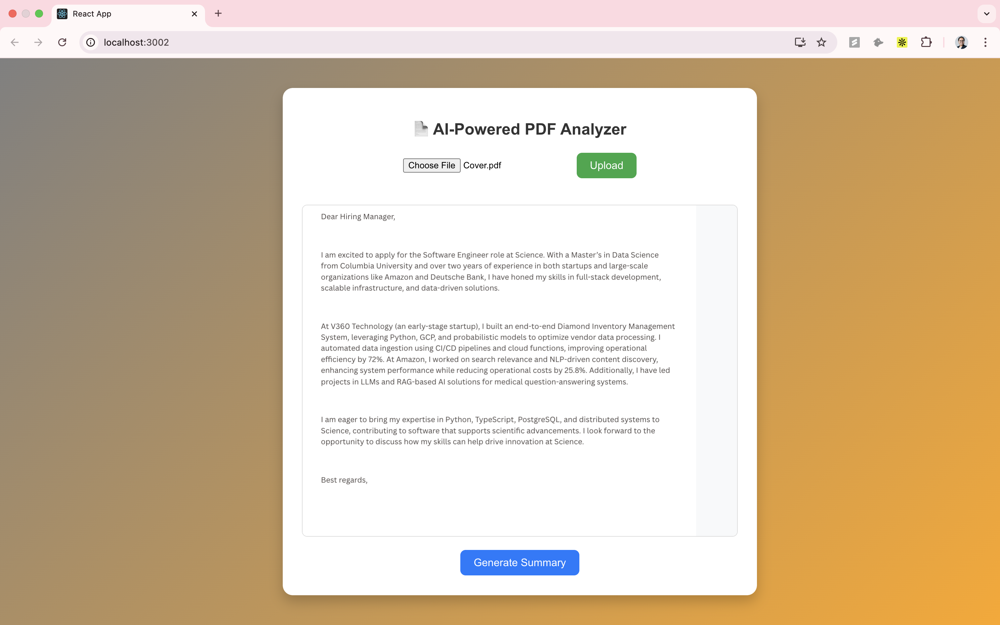

# **AI-Powered PDF Analyzer 📄🤖**
An AI-driven tool that extracts text from **PDF files**, generates **summaries**, detects **errors**, and allows 
**human-in-the-loop feedback** to refine the results.




## **🚀 Features**
- ✅ **Upload PDFs** and display them directly in the UI.
- ✅ **Text Extraction** using `pdf-parse` and `Tesseract.js` (for scanned images).
- ✅ **AI-Powered Summarization** using `OpenAI GPT-4-turbo`.
- ✅ **Error Detection** for grammar/spelling issues.
- ✅ **Feedback Loop** to refine AI-generated summaries.
- ✅ **Stylish UI** with a **gradient background**, **centered layout**, and **smooth scrolling**.

---

## **📂 Project Structure**
```
AI-Powered-PDF-Analyzer
│── backend/                   # Express.js backend
│   ├── uploads/               # Uploaded PDFs stored here
│   ├── documents.db           # SQLite database
│   ├── server.ts              # Backend logic (Express, OpenAI, PDF processing)
│   ├── package.json           # Backend dependencies
│── frontend/                  # React frontend
│   ├── src/
│   │   ├── App.tsx            # Main React Component
│   │   ├── App.css            # Styling
│   │   ├── index.tsx          # Entry point
│   ├── package.json           # Frontend dependencies
│── README.md                  # Project documentation
```
## **🛠 Installation & Setup**

### **1️⃣ Clone the Repository**

```sh
git clone https://github.com/your-username/AI-Powered-PDF-Analyzer.git
cd AI-Powered-PDF-Analyzer
```

### **2️⃣ Backend Setup**

#### Install dependencies
```sh
cd backend
npm install
```

#### Set up environment variables

Create a .env file in the backend folder:
```sh
OPENAI_API_KEY=your_openai_api_key
```

#### Run the backend
```sh
npx ts-node server-v2.ts
```

The backend should now be running on http://localhost:3000.

### **3️⃣ Frontend Setup**

#### Install dependencies
```sh
cd backend
npm install
```

#### Run the backend
```sh
npm start
```

The frontend should now be running on http://localhost:3002.

## 📝 How to Use
1. **Upload a PDF file** – Click **"Choose File"** and select a PDF.
2. **Click Upload** – The file will be saved and displayed.
3. **Click "Generate Summary & Find Errors"** – AI will generate a summary and highlight errors.
4. **Provide Feedback** – Approve the summary or request improvements.
5. **Refined Summary** – If feedback is provided, AI will regenerate a better version.

---

## 📜 License
This project is open-source and licensed under the **MIT License**.

---

## 💡 Future Enhancements
- ✅ **Text Highlighting on Errors** – Mark grammar/spelling issues on the document.
- ✅ **Support for Other File Types** – Extend support for **.docx** and **.txt**.

---

## 🎉 Enjoy AI-powered document analysis! 🚀